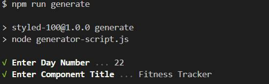

<!-- @format -->

# Styled 100

The [CSS 100 Challenge](https://codepen.io/collection/DYwpLQ?grid_type=list&sort_col=updated_at&sort_order=desc) implemented with [styled-components](https://styled-components.com/).
[Next.js](https://nextjs.org/) is used as the React framework.

## Local Setup

```
npm install
npm start
```

## Generator CLI

Use this to generate boilerplate to start developing a new component



## Deploying

```
npm run build
```

This will generate the `out` folder that can be deployed as a static site.
